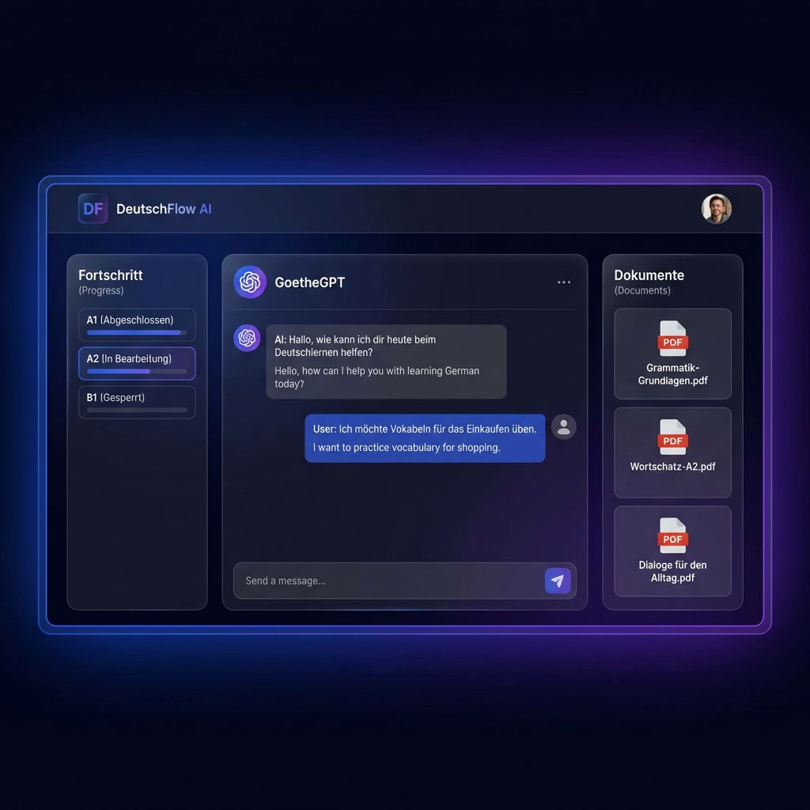

# 🇩🇪 German Learning RAG SaaS

[](https://www.python.org/)
[](https://fastapi.tiangolo.com/)
[](https://nextjs.org/)
[](https://www.postgresql.org/)
[](https://opensource.org/licenses/Apache-2.0)

A production-grade, AI-powered German language learning platform leveraging **Retrieval-Augmented Generation (RAG)**. This system transforms static study materials into interactive, level-aware tutoring experiences, helping learners master German with context-driven AI assistance.



---

##  Table of Contents
- [ Key Features](#-key-features)
- [ Architecture](#️-architecture)
- [ Getting Started](#-getting-started)
  - [Prerequisites](#prerequisites)
  - [Backend Setup](#backend-setup)
  - [Frontend Setup](#frontend-setup)
- [ Usage](#️-usage)
- [ Roadmap](#️-roadmap)
- [ Contributing](#-contributing)
- [ License](#-license)
- [ Acknowledgments](#-acknowledgments)

---

##  Key Features

- **Context-Aware Tutoring**: AI responses are grounded in your uploaded documents (PDFs, text files) using vector search.
- **Pedagogical Intelligence**: Supports multiple tutoring modes (Socratic, Grammar-focused, Translation) tailored to CEFR levels (A1-C2).
- **Async-First Pipeline**: High-performance backend designed for concurrency using non-blocking LLM calls.
- **Modern UI**: Sleek, responsive Next.js dashboard with dark mode and glassmorphism aesthetics.
- **Production-Ready**: Domain-Driven Design (DDD), integrated monitoring, and task queues for heavy document processing.

---

## 🏗️ Architecture

The project follows **Domain-Driven Design (DDD)** principles for clear separation of concerns and scalability.

```
├── src/                          # Backend (FastAPI)
│   ├── domains/                  # Core Business Logic
│   │   ├── identity/            # Auth & User Management
│   │   ├── learning/            # Project & Document Management
│   │   └── tutor/               # RAG Pipeline & Tutoring Logic
│   ├── infrastructure/           # LLM Providers & DB Clients
│   └── api/                      # Versioned API Endpoints
├── frontend/                     # Frontend (Next.js)
│   └── src/app/                  # App Router & Components
└── docker/                       # Infrastructure Orchestration
```

---

## 🚀 Getting Started

### Prerequisites
- **Python 3.10+** (Conda recommended)
- **Node.js 18+** & npm
- **PostgreSQL** with [pgvector](https://github.com/pgvector/pgvector) extension
- **Redis** & **RabbitMQ** (for task queuing)
- **OpenAI API Key**

### Backend Setup

1. **Activate Environment**:
   ```bash
   conda activate mini-rag-app
   ```

2. **Install Dependencies**:
   ```bash
   chmod +x quick-start.sh
   ./quick-start.sh
   ```

3. **Configure Environment**:
   Copy `.env.example` to `.env` in the `src/` directory and fill in your keys:
   ```bash
   cp src/.env.example src/.env
   # Edit src/.env with your API keys
   ```

4. **Run Migrations**:
   ```bash
   cd src/models/db_schemes/minirag
   alembic upgrade head
   ```

5. **Start the API**:
   ```bash
   cd src
   uvicorn main:app --reload
   ```

### Frontend Setup

1. **Install Dependencies**:
   ```bash
   cd frontend
   npm install
   ```

2. **Start Dev Server**:
   ```bash
   npm run dev
   ```
   Access the UI at `http://localhost:3000`.

---

## Usage

### Interactive Chat
Upload your German study materials (e.g., "Grammatik-A2.pdf") in the dashboard. The **TutorService** will index the content into the vector store, allowing you to ask questions like:
- *"Explain the passive voice using examples from my document."*
- *"Can you quiz me on the vocabulary from Chapter 3?"*

### API Interaction
Full API documentation is available at `http://localhost:8000/docs`. Major endpoints:
- `POST /api/v1/auth/register`: Create a new user account.
- `POST /api/v1/nlp/tutor/chat`: Send a message to the AI tutor.
- `POST /api/v1/assets/upload`: Upload document assets for RAG.

---

## 🛤️ Roadmap

- [ ] **Phase 1 (Done)**: Domain-Driven Refactor & Async LLM integration.
- [ ] **Phase 2 (Current)**: Frontend dashboard & JWT authentication implementation.
- [ ] **Phase 3**: Semantic caching with Redis & LLM cost tracking.
- [ ] **Phase 4**: Hybrid search (Keyword + Semantic) & Citation tracking.

---

## Contributing

Contributions are welcome! Please follow these steps:
1. Fork the repo.
2. Create your feature branch (`git checkout -b feature/AmazingFeature`).
3. Commit your changes (`git commit -m 'Add some AmazingFeature'`).
4. Push to the branch (`git push origin feature/AmazingFeature`).
5. Open a Pull Request.

---

## 📜 License

Distributed under the **Apache License 2.0**. See `LICENSE` for more information.

---

## 🙏 Acknowledgments

- [FastAPI](https://fastapi.tiangolo.com/) for the high-performance backend.
- [Next.js](https://nextjs.org/) for the modern frontend experience.
- [pgvector](https://github.com/pgvector/pgvector) for efficient vector similarity search.
- The open-source community for the incredible libraries that made this project possible.

---
*Built with ❤️ for German learners everywhere.*
