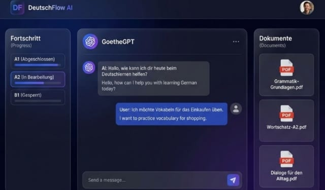

# 🇩🇪 German Learning RAG SaaS (Still in Progress)

[](https://www.python.org/)
[](https://fastapi.tiangolo.com/)
[](https://nextjs.org/)
[](https://www.postgresql.org/)
[](https://opensource.org/licenses/Apache-2.0)

A production-grade, AI-powered German language learning platform leveraging **Retrieval-Augmented Generation (RAG)**. This system transforms static study materials into interactive, level-aware tutoring experiences, helping learners master German with context-driven AI assistance.



---

##  Table of Contents
- [ Key Features](#-key-features)
- [ Architecture](#️-architecture)
- [ Getting Started](#-getting-started)
  - [Prerequisites](#prerequisites)
  - [Backend Setup](#backend-setup)
  - [Frontend Setup](#frontend-setup)
- [ Usage](#️-usage)
- [ Roadmap](#️-roadmap)
- [ Contributing](#-contributing)
- [ License](#-license)
- [ Acknowledgments](#-acknowledgments)

---

##  Key Features

- **Context-Aware Tutoring**: AI responses are grounded in your uploaded documents using vector search (PGVector/Qdrant).
- **Pedagogical Intelligence**: Multi-mode tutoring (Socratic, Grammar, Translate) tailored to CEFR levels (A1-C2).
- **Secure by Design**: Redis-backed rate limiting, prompt injection sanitization, and JWT-based authentication.
- **Usage Quotas**: Built-in freemium logic with daily message limits and storage caps for free-tier users.
- **Modern UI**: High-fidelity Next.js dashboard with dark mode, glassmorphism, and interactive learning paths.
- **Async Pipeline**: Non-blocking LLM calls and background document processing via Celery & RabbitMQ.

---

##  Architecture

The project follows **Domain-Driven Design (DDD)** principles for clear separation of concerns and scalability.

```
├── src/                          # Backend (FastAPI)
│   ├── domains/                  # Core Business Logic (Identity, Learning, Tutor)
│   ├── infrastructure/           # LLM Providers (OpenAI/CoHere) & DB Clients
│   ├── routes/                   # Secure, versioned API Endpoints
│   ├── security/                 # Redis Rate Limiter, Sanitizers & Quota Guards
│   └── main.py                   # App Initialization & Middleware
├── frontend/                     # Frontend (Next.js 16)
│   ├── src/app/                  # App Router: Dashboard, Chat, Learning Path
│   ├── src/services/             # Axios API Clients with JWT Interceptors
│   └── src/context/              # Global Auth & UI State
└── docker/                       # Full Stack Orchestration (Postgres, Redis, RabbitMQ, Qdrant)
```

---

## 🚀 Getting Started

### Prerequisites
- **Python 3.10+** (Conda recommended)
- **Node.js 18+** & npm
- **PostgreSQL** with [pgvector](https://github.com/pgvector/pgvector) extension
- **Redis** & **RabbitMQ** (for task queuing)
- **OpenAI API Key**

### Backend Setup

1. **Activate Environment**:
   ```bash
   conda activate mini-rag-app
   ```

2. **Install Dependencies**:
   ```bash
   chmod +x quick-start.sh
   ./quick-start.sh
   ```

3. **Configure Environment**:
   Copy `.env.example` to `.env` in the `src/` directory and fill in your keys:
   ```bash
   cp src/.env.example src/.env
   # Edit src/.env with your API keys
   ```

4. **Run Migrations**:
   ```bash
   cd src/models/db_schemes/minirag
   alembic upgrade head
   ```

5. **Start the API**:
   ```bash
   cd src
   uvicorn main:app --reload --port 5000
   ```

### Frontend Setup

1. **Configure API URL**:
   Create `.env.local` in the `frontend/` directory:
   ```bash
   echo "NEXT_PUBLIC_API_URL=http://localhost:5000" > frontend/.env.local
   ```

2. **Install Dependencies**:
   ```bash
   cd frontend
   npm install
   ```

3. **Start Dev Server**:
   ```bash
   npm run dev
   ```
   Access the UI at `http://localhost:3000`.

### Cloud Deployment (K8s)

1. **Configure Secrets**:
   Edit `k8s/namespace-and-secrets.yaml` with your base64-encoded credentials.

2. **Deploy to Cluster**:
   ```bash
   kubectl apply -f k8s/
   ```

3. **Verify Health**:
   Check the centralized health endpoints:
   - `http://localhost:5000/health`: General health.
   - `http://localhost:5000/api/v1/health/llm`: OpenAI/Embedding diagnostics.

---

## Evolution & Reliability Improvements

Recently implemented features focusing on production-readiness:

- **Redis-Backed Resilience**: Integrated `redis.asyncio` for rate limiting. Implemented a **fail-open strategy**—if Redis goes down, the API stays available, ensuring zero downtime for users while maintaining security state.
- **Advanced Embeddings**: Migrated to OpenAI's `text-embedding-3-small` (1536-dim) for superior multilingual retrieval performance.
- **Data Flow Fixes**: Removed all frontend mock data. The **Dashboard** and **Projects** views are now 100% powered by user-scoped backend APIs.
- **Connectivity Awareness**: Added a `BackendStatusBanner` in the UI that pings the `/health` endpoint and provides real-time feedback if the backend is unreachable.
- **Developer Debugging**: Integrated a `DevDebugPanel` (visible in dev mode) to track active user state, project IDs, and API base URLs in real-time.

---

## Usage

### Interactive Chat
Upload your German study materials in the dashboard under **Projekte**. The **TutorService** indexes the content into an isolated vector store per project. You can selected between:
- **Socratic Mode**: The tutor asks questions to lead you to the answer.
- **Grammar Mode**: Focuses on morphological and syntactic analysis.
- **Translate Mode**: Precise bilingual assistance.

### API Interaction
Full API documentation is available at `http://localhost:5000/docs`. Major endpoints:
- `POST /api/v1/auth/login`: Authenticate and receive JWT.
- `GET /api/v1/dashboard/stats`: Fetch real user-activity metrics.
- `GET /api/v1/projects`: Manage user-scoped RAG projects.
- `POST /api/v1/nlp/index/answer/{project_id}`: Targeted RAG querying.

---

##  Roadmap

- [x] **Phase 1: Foundation**: Domain-Driven Refactor & Async LLM integration.
- [x] **Phase 2: Redesign**: User models, Progress tracking & Persistence layers.
- [x] **Phase 3: Frontend**: Premium Next.js dashboard & CEFR-aware UI.
- [x] **Phase 4: Security**: Redis rate limiting, Prompt sanitization & Quota guards.
- [x] **Phase 5: Cloud**: Docker optimization, K8s manifests & CI/CD pipelines.
- [x] **Phase 6: Reliability**: Centralized logging, Error tracking (Sentry) & Metrics.
- [x] **Phase 7: SaaS**: Freemium gating, Product Roadmap & Scalability analysis.

---

## Contributing

Contributions are welcome! Please follow these steps:
1. Fork the repo.
2. Create your feature branch (`git checkout -b feature/AmazingFeature`).
3. Commit your changes (`git commit -m 'Add some AmazingFeature'`).
4. Push to the branch (`git push origin feature/AmazingFeature`).
5. Open a Pull Request.

---

##  License

Distributed under the **Apache License 2.0**. See `LICENSE` for more information.

---

##  Acknowledgments

- [FastAPI](https://fastapi.tiangolo.com/) for the high-performance backend.
- [Next.js](https://nextjs.org/) for the modern frontend experience.
- [pgvector](https://github.com/pgvector/pgvector) for efficient vector similarity search.
- The open-source community for the incredible libraries that made this project possible.

---
*Built with ❤️ for German learners everywhere.*
